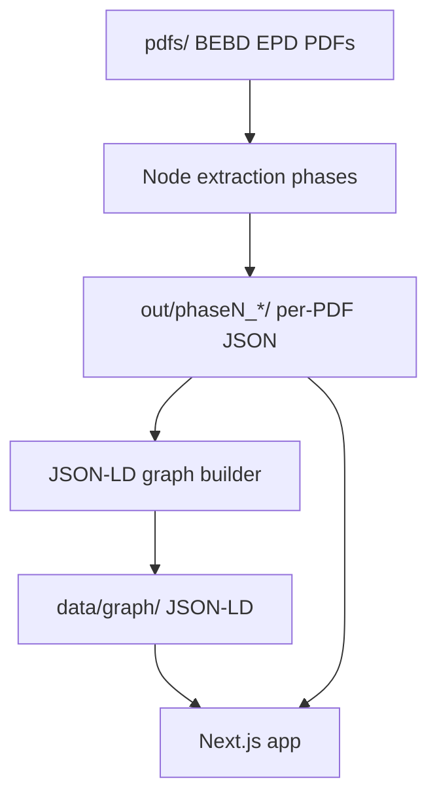

# Architecture

EPDagent turns BEBD Environmental Product Declaration (EPD) PDFs into structured data and a linked knowledge graph. The system has three layers that stay loosely coupled.

## Layers

### 1. Extraction pipeline (Node / TypeScript)

Local-first CLI phases. Each phase reads from `pdfs/`, writes one JSON file per PDF under `out/phaseN_<name>/`. Phases do not depend on each other at runtime — re-run any phase in isolation.

Schemas in `schemas/` define the extraction contract. Extractors (regex, Claude API, future parsers) can be swapped without changing downstream consumers.

See [pipeline-overview.md](pipeline-overview.md).

### 2. Knowledge graph (JSON-LD)

Phase outputs are **flat, validation-friendly JSON**. A separate step materializes **node graphs as JSON-LD**: stable `@id` IRIs, typed nodes, and edges via JSON-LD properties — not a custom adjacency-list format.

Goals:

- Interoperable with JSON-LD 1.1 tooling (compaction, framing, RDF export).
- Explicit provenance: which phase and PDF produced each node.
- Merge-friendly: new extractions add or update nodes without rewriting the whole graph.

See [knowledge-graph.md](knowledge-graph.md) and [open-standards.md](open-standards.md).

### 3. Application (Next.js)

Next.js is the product surface:

- Browse EPDs, phase outputs, and graph entities.
- Trigger or display extraction status (future).
- Serve or visualize JSON-LD (graph explorer, SPARQL or HTTP later if needed).

The app reads published artifacts (`out/`, `data/graph/`). It does not replace the CLI pipeline for batch extraction.

## Folder layout (target)

| Path | Role |
|------|------|
| `pdfs/` | Source PDFs (symlink or local copy) |
| `src/` | Extraction phase scripts |
| `schemas/` | JSON Schema per phase |
| `out/phaseN_*/` | Per-PDF extraction output |
| `data/graph/` | Merged JSON-LD graph documents |
| `app/` | Next.js App Router (to be added) |
| `docs/` | Internal knowledge base |

## Design principles

1. **Schema-first extraction** — phases validate against JSON Schema before merge.
2. **Open standards for the graph** — JSON-LD, IRIs, public vocabularies where they fit; project terms only when necessary.
3. **Independent phases** — same PDF, different phase folders; no hidden coupling.
4. **Inspectability** — every step produces human-readable JSON on disk.
