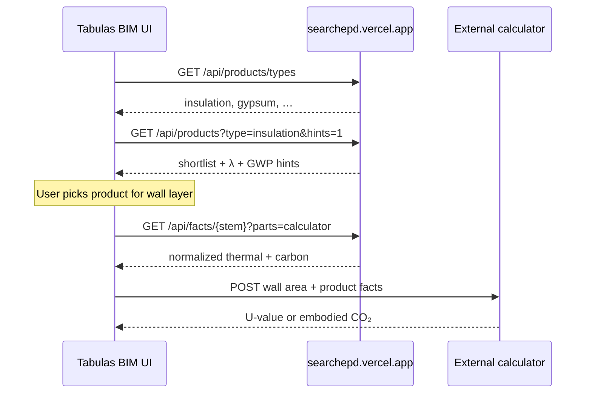

# Product Facts API (cross-domain read)

Read API for **Tabulas / Pentapylas**: discover EPD products by **type** and **name**, fetch **thermal** and **carbon** facts for an external calculator. EPDagent publishes; the BIM app consumes from another domain (CORS or server proxy).

## BIM case study flow (Tabulas)



1. **Wall from IFC** — geometry stays in Tabulas (area, thickness).
2. **Filter products** — `type=insulation`, optional `q=rockwool`.
3. **Compare shortlist** — use `hints=1` on catalog or fetch `parts=calculator` per stem.
4. **Calculate** — Tabulas sends BIM quantities + EPD facts to your calculator service.

## Endpoints

| Method | Path | Purpose |
|--------|------|---------|
| `GET` | `/api/products/types` | Product types in corpus + counts |
| `GET` | `/api/products?…` | Search / filter catalog (v2 schema) |
| `GET` | `/api/facts/{stem}?parts=…` | Sliced facts per EPD |
| `GET` | `/api/epds` | Full EPD index (legacy; prefer `/api/products`) |
| `GET` | `/api/graph/{stem}` | Full JSON-LD graph |

### Catalog search (`/api/products`)

| Param | Example | Description |
|-------|---------|-------------|
| `type` or `tag` | `insulation` | Single category (aliases) |
| `types` | `insulation,gypsum` | Multiple categories (OR) |
| `q` | `rockwool` | Substring: name, stem, EPD no., description, producer |
| `producer` | `ROCKWOOL` | Producer name substring |
| `has_thermal` | `true` | Only products with λ (or thermal table) |
| `has_lca` | `true` | Only products with LCA probe / graph |
| `hints` | `1` | Include `calculator_hints` on each row |
| `limit` | `20` | Page size (default 50, max 100) |
| `offset` | `0` | Pagination |

Response schema: `epdagent.product-catalog.v2`.

```bash
# Types for a filter dropdown
curl -s 'https://searchepd.vercel.app/api/products/types'

# Insulation products with calculator preview
curl -s 'https://searchepd.vercel.app/api/products?type=insulation&has_thermal=true&hints=1&limit=10'

# Name search
curl -s 'https://searchepd.vercel.app/api/products?q=kingspan&hints=1'
```

Each product includes:

- `primary_type`, `types[]` — categories
- `facts_url` — full facts
- `calculator_url` — shortcut: `?parts=calculator,thermal,lca`

With `hints=1`, each row adds `calculator_hints`:

```json
{
  "thermal": { "lambda_W_mK": 0.035, "property_label": "Thermal characteristics (λD)", "unit": "W/m.K" },
  "carbon": { "gwp_a1_a3": "12.4", "gwp_unit": "kg CO2 eq", "declared_unit": "1 m²" }
}
```

### Product types

| `id` | Typical use in BIM case study |
|------|-------------------------------|
| `insulation` | Wall / roof thermal layers |
| `gypsum` | Boards, finishing |
| `concrete` | Structure, screed |
| `windows` | Glazing / frames |
| `roofing` | Membranes |
| `paint` | Coatings |
| `masonry` | Blocks |
| `other` | Fallback |

Types are inferred from product text (phase 2/3); not manually curated yet.

### Facts (`/api/facts/{stem}`)

`parts` — comma-separated:

| Part | Content |
|------|---------|
| `identity` | stem, IRI, EPD number, producer |
| `product` | description, types, tags, reference flow |
| `thermal` | technical property rows (λ, etc.) |
| `lca` | EN 15804 module grid |
| `calculator` | normalized `thermal` + `carbon` for external calc |
| `composition` | material rows |

```bash
curl -s 'https://searchepd.vercel.app/api/facts/B-EPD_023.0011.007-02.00.00%20Rockwool%20Rockfit%20Mono%20EN%20-%20signed?parts=calculator'
```

## CORS

Enabled on `/api/products`, `/api/products/types`, `/api/facts/*`, `/api/graph/*`, `/api/epds`.

```bash
EPDAGENT_CORS_ORIGINS=https://tabulas.eu,http://localhost:3001
```

Production Tabulas can use a **backend proxy** instead; CORS is for local UI dev.

## Local test

```bash
npm run test:facts
npm run dev
npm run test:facts-api
```

## Vercel (serve only)

Extract locally, commit `out/phase*` slices + `data/graph/`, deploy. See **[vercel-deploy.md](vercel-deploy.md)**.

- `EPDAGENT_IRI_BASE=https://searchepd.vercel.app/id`
- Do **not** set `EPDAGENT_PDF_DIR` or `ANTHROPIC_API_KEY` on Vercel

## Tabulas integration

```ts
const BASE = "https://searchepd.vercel.app";

const types = await fetch(`${BASE}/api/products/types`).then((r) => r.json());

const catalog = await fetch(
  `${BASE}/api/products?type=insulation&has_thermal=true&hints=1&limit=20`
).then((r) => r.json());

const facts = await fetch(
  `${BASE}/api/facts/${encodeURIComponent(selectedStem)}?parts=calculator`
).then((r) => r.json());

// POST { wall_area_m2, layer_thickness_mm, product: facts.calculator } → your calculator
```

## Related

- [vercel-deploy.md](vercel-deploy.md) — deploy + env
- [architecture.md](architecture.md) — publisher vs consumer split
- [knowledge-graph.md](knowledge-graph.md) — full JSON-LD
