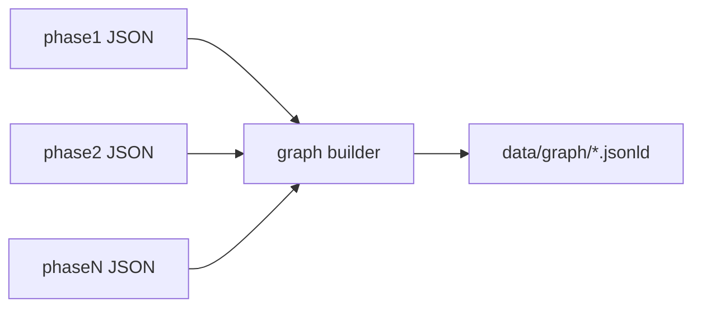

# Knowledge graph as JSON-LD

The knowledge graph is a set of **JSON-LD documents**: typed nodes, IRIs as `@id`, relationships as JSON-LD properties. We avoid proprietary graph JSON (custom `{ nodes: [], edges: [] }` only) as the canonical form.

## Why JSON-LD

- **Open standard:** [JSON-LD 1.1](https://www.w3.org/TR/json-ld11/) (W3C).
- **Node graphs:** each entity is an object with `@id` and `@type`; edges are nested references or `@id` objects.
- **Tooling:** compaction, framing, RDF export (N-Quads, Turtle) when we need them.
- **Web-native:** fits Next.js API routes and static `data/graph/` assets.

## Node model (draft)

Each EPD corpus entry is anchored by a stable IRI, e.g.:

```json
{
  "@context": {
    "@vocab": "https://epdagent.dev/vocab/",
    "schema": "https://schema.org/",
    "prov": "http://www.w3.org/ns/prov#"
  },
  "@id": "https://epdagent.dev/epd/EPD-S-P-12345-EN",
  "@type": ["EPD", "schema:Product"],
  "schema:name": "…",
  "programOperator": { "@id": "https://epdagent.dev/operator/BE-BD" },
  "producer": { "@id": "https://epdagent.dev/org/…" },
  "prov:wasDerivedFrom": {
    "@type": "prov:Entity",
    "schema:contentUrl": "file:pdfs/EPD-S-P-12345-EN.pdf"
  }
}
```

Exact `@context` and property names will be refined as phases land. Prefer existing vocabularies; add `https://epdagent.dev/vocab/` terms only for EPD-specific fields (declared unit, PCR reference, LCA modules).

## Build pipeline (planned)



1. **Validate** phase JSON against `schemas/`.
2. **Map** fields to JSON-LD types and properties (mapping table in repo, versioned).
3. **Assign IRIs** deterministically from EPD id + entity role (producer, verifier, impact category).
4. **Merge** into graph: same `@id` updates in place; `prov:generatedAt` / extraction meta preserved.
5. **Write** JSON-LD to `data/graph/` (one file per EPD plus optional `corpus.jsonld`).

## Next.js consumption

- Static import or fetch from `/data/graph/` (public or API route).
- UI: list EPDs, expand linked orgs, show LCA modules when phase 4 exists.
- Optional later: `@context` served at `/.well-known/jsonld-context` for external consumers.

## Open questions (record answers here as we decide)

- Canonical IRI base: `https://epdagent.dev/` vs configurable `EPDAGENT_IRI_BASE`.
- Single `@graph` array vs one document per entity.
- Alignment with ILCD+EPD or other EPD RDF vocabularies if a public ontology fits.

See [open-standards.md](open-standards.md) for normative references.
