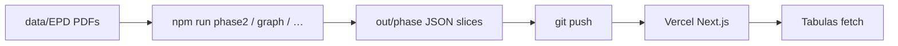

# Vercel deploy: extract local, serve on domain

EPDagent uses **two environments** with different jobs. Do not run full PDF extraction on Vercel Hobby; use the Vercel URL only to **publish** data you already extracted locally.

## Split

| Where | Role | What runs |
|-------|------|-----------|
| **Local** (`npm run dev`, CLI) | **Extract** | Phases, docmap, Claude API, `out/`, optional `/api/extract` from the UI |
| **Vercel** (production domain) | **Serve** | Read APIs for Tabulas / Pentapylas: `/api/products`, `/api/facts`, `/api/graph`, `/api/epds` |



## Publish workflow (local → Vercel)

1. **Extract locally** (needs `ANTHROPIC_API_KEY`, PDFs in `data/EPD/`):

   ```bash
   npm run phase2 -- "data/EPD/….pdf"
   npm run phase3 -- "data/EPD/….pdf"
   # … other phases as needed
   npm run graph
   ```

2. **Commit published artifacts** (already whitelisted in `.gitignore`):

   - `out/phase2_header/`, `out/phase3_product/`, `out/phase3_composition/`, `out/phase3_lca_study/`, `out/phase4_lca_probe/`
   - `data/graph/*.jsonld`

   Do **not** rely on committing full `out/` (docmap cache, `pdf_slices/`, etc.) unless you intend to.

3. **Push to GitHub** → Vercel redeploys.

4. **Tabulas** calls your Vercel base URL, e.g.  
   `https://your-app.vercel.app/api/products?tag=insulation`

See [facts-api.md](facts-api.md) for endpoints, CORS, and env vars.

## What Vercel is not for

- Bulk `npm run phase2 -- --all` on the server (no reliable long runs on Hobby).
- Storing or processing large PDF corpora in serverless functions.
- `ANTHROPIC_API_KEY` on Vercel unless you explicitly accept API cost and timeouts (optional; not required for read-only serve).

The EPD **UI** on Vercel can still list EPDs and show graphs built from committed JSON. In-browser “Extract PDF” may hit route timeouts on Hobby — treat that as a **local dev** feature.

## Serverless `maxDuration` (two limits)

Extract API routes set `export const maxDuration` in:

- `app/api/extract/[...stem]/route.ts`
- `app/api/extract/step/[...stem]/route.ts`

| Environment | Limit | Value in repo | Notes |
|-------------|-------|---------------|--------|
| **Vercel Hobby** | Platform max | **300** seconds | Required for deploy; builder rejects values &gt; 300. |
| **Local `next dev`** | No Vercel cap | Same constant (300) unless you raise it | For long local UI extracts, you may set **600** in those two files on your machine only — **do not push &gt; 300** if the project stays on Hobby. |
| **Vercel Pro** | Up to 800s on some plans | May raise route constant + confirm plan limit | Only after upgrading; still prefer extract via CLI. |

There is no separate env var: Vercel validates the **numeric literal** at build time. “Two limits” means **platform (300 on Hobby)** vs **optional higher value for local/Pro** in source, not two runtime configs.

**Read routes** (`/api/facts`, `/api/products`, `/api/graph`) have no `maxDuration`; they only read JSON from disk and are safe on Vercel.

## Vercel project settings

| Variable | Example | Required for serve |
|----------|---------|-------------------|
| `EPDAGENT_IRI_BASE` | `https://searchepd.vercel.app/id` | **Yes** — wrong value yields `localhost` IRIs in `/api/facts` |
| `EPDAGENT_CORS_ORIGINS` | `https://tabulas.eu,http://localhost:3001` | For browser calls from Tabulas |
| `ANTHROPIC_API_KEY` | — | **Remove** (extract local) |
| `EPDAGENT_PDF_DIR` | — | **Remove** — use repo `data/EPD/`; invalid paths break `/api/epds` and `/api/products` |

## Verify after deploy

```bash
curl -s "https://searchepd.vercel.app/api/products?tag=insulation" | head
curl -s "https://searchepd.vercel.app/api/epds" | head
curl -s "https://searchepd.vercel.app/api/facts/B-EPD_023.0011.007-02.00.00%20Rockwool%20Rockfit%20Mono%20EN%20-%20signed?parts=thermal,lca" | head
```

If `/api/epds` returns **500** with an empty body, check Vercel env: delete **`EPDAGENT_PDF_DIR`** if it points outside the deployment (or to a missing folder).

### pdfjs / EPD detail pages

On Vercel (`VERCEL=1`), EPD routes use **serve-only** mode: they do not auto-build docmap or phase7 from PDF text. Committed `out/phase_docmap/` (if any) and phase JSON still load.

EPD pages must **not** statically import `ensure-docmap` / `ensure-phase7` (those pull `pdfjs-dist` and fail with missing `pdf.worker.mjs` on serverless). Use `ensurePdfArtifactsForStem()` from `lib/extract/ensure-pdf-artifacts.ts` instead.

`pdfjs-dist` optionally loads `@napi-rs/canvas`. The repo lists it under `optionalDependencies`. Extraction stays **local**. Warnings during `/api/extract` on Vercel are expected on Hobby — Tabulas should use `/api/products` and `/api/facts` only.

## Related

- [facts-api.md](facts-api.md) — cross-domain Product Facts API
- [local-dev.md](local-dev.md) — scripts and local server
- [api-budget-policy.md](api-budget-policy.md) — Claude usage (local only)
